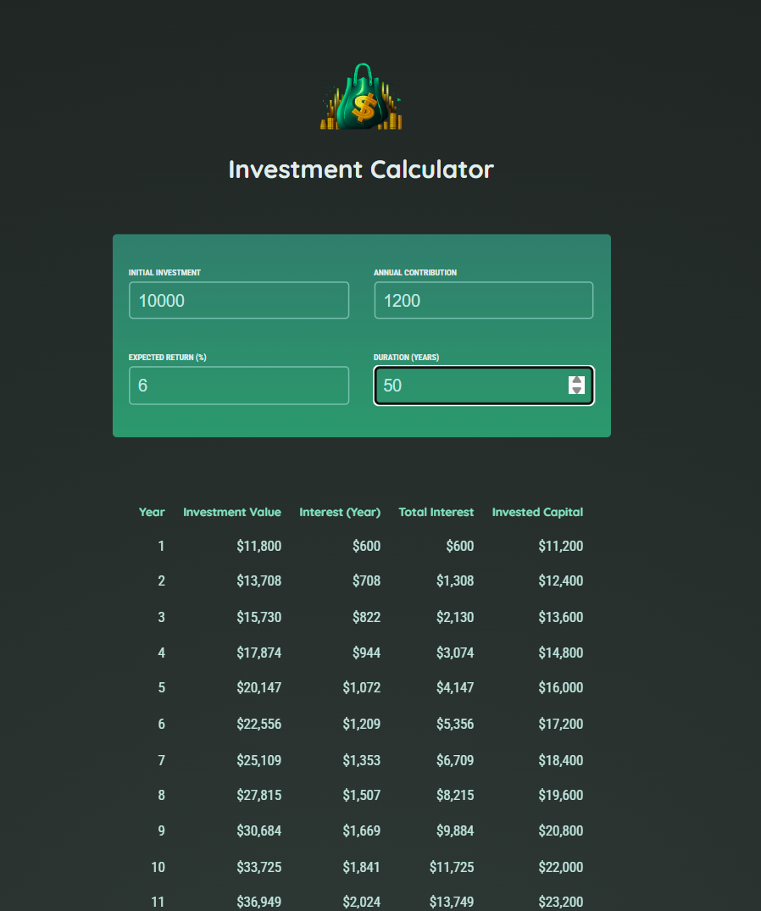

# Investment Calculator 📈

A React-based investment calculator that helps you visualize your investment growth over time with compound interest calculations.



## Features ✨

- **Real-time calculations**: Instantly see how your investments will grow
- **Compound interest**: Accurate calculations including annual contributions
- **Interactive inputs**: Easy-to-use form with immediate feedback
- **Detailed breakdown**: Year-by-year analysis of your investment growth
- **Professional formatting**: Currency values formatted for easy reading
- **Input validation**: Ensures duration is at least 1 year

## Demo 🚀

The calculator shows:
- Initial investment amount
- Annual contributions
- Expected return percentage
- Investment duration in years
- Year-by-year breakdown including:
  - Investment value at end of each year
  - Interest earned each year
  - Total interest accumulated
  - Total invested capital

## Technologies Used 🛠️

- **React 19** - Frontend framework
- **Vite** - Build tool and development server
- **JavaScript ES6+** - Programming language
- **CSS3** - Styling with modern gradients and responsive design
- **HTML5** - Semantic markup

## Getting Started 🏁

### Prerequisites

- Node.js (version 14 or higher)
- npm or yarn package manager

### Installation

1. Clone the repository:
```bash
git clone https://github.com/Eslamsaeed880/Investment-Calculator.git
cd Investment-Calculator
```

2. Install dependencies:
```bash
npm install
```

3. Start the development server:
```bash
npm run dev
```

4. Open your browser and navigate to `http://localhost:5173`

## Usage 💡

1. **Initial Investment**: Enter your starting investment amount
2. **Annual Contribution**: Set how much you plan to invest each year
3. **Expected Return**: Input your expected annual return percentage
4. **Duration**: Specify the investment period in years (minimum 1 year)

The calculator will automatically update the results table showing:
- Year-by-year breakdown
- Investment value growth
- Annual interest earned
- Cumulative totals

## Project Structure 📁

```
investment-calculator/
├── public/
│   ├── investment-calculator-logo.png
│   └── image.png
├── src/
│   ├── assets/
│   │   └── investment-calculator-logo.png
│   ├── components/
│   │   ├── UserInputs.jsx          # Input form component
│   │   └── Result.jsx              # Results table component
│   ├── util/
│   │   └── investment.js           # Calculation logic and formatting
│   ├── App.jsx                     # Main application component
│   ├── index.jsx                   # Application entry point
│   └── index.css                   # Global styles
├── .gitignore                      # Git ignore rules
├── index.html                      # HTML template
├── package.json                    # Project dependencies
├── package-lock.json               # Dependency lock file
├── vite.config.js                  # Vite configuration
└── README.md                       # Project documentation
```

## Available Scripts 📜

- `npm run dev` - Start development server
- `npm run build` - Build for production
- `npm run preview` - Preview production build
- `npm run lint` - Run ESLint for code quality

## Formula Used 📊

The calculator uses compound interest formula with annual contributions:

```
FV = PV × (1 + r)^n + PMT × [((1 + r)^n - 1) / r]
```

Where:
- FV = Future Value
- PV = Present Value (Initial Investment)
- r = Annual Interest Rate
- n = Number of Years
- PMT = Annual Payment (Annual Contribution)

## Contributing 🤝

1. Fork the repository
2. Create a feature branch (`git checkout -b feature/AmazingFeature`)
3. Commit your changes (`git commit -m 'Add some AmazingFeature'`)
4. Push to the branch (`git push origin feature/AmazingFeature`)
5. Open a Pull Request

## License 📄

This project is open source and available under the [MIT License](LICENSE).

## Contact 📬

**Eslam Saeed** - [@Eslamsaeed880](https://github.com/Eslamsaeed880)

Project Link: [https://github.com/Eslamsaeed880/Investment-Calculator](https://github.com/Eslamsaeed880/Investment-Calculator)

## Acknowledgments 🙏

- React team for the amazing framework
- Vite for the fast development experience
- Google Fonts for the beautiful typography (Quicksand & Roboto Condensed)

---

Made with ❤️ by [Eslam Saeed](https://github.com/Eslamsaeed880)
